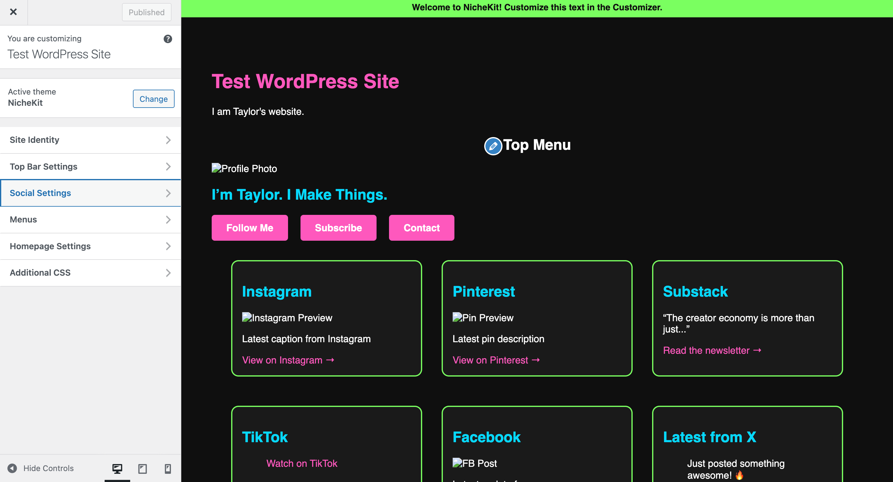

# NicheKit
This is a custom designed WordPress theme for social media influencers 
with multiple channels of content.

## Project Overview
NicheKit is a WordPress theme designed specifically for social media influencers 
who want a central brand kit on their website that directs their fans to their
multiple channels of written, audio, and video content.

The following technologies were used in the development of this project:

* PhpStorm
* PHP
* MySQL
* HTML
* CSS
* Git/GitHub

## Development
I started this project on May 7, 2025, as a challenge to further develop my WordPress
design and development skills. However, I also started developing it with the plan of 
publishing it as a professional product when it's complete with a
full design and premium features.

My primary goal for this project is to give influencers a central place to direct 
fans and other website visitors to all the content properties they maintain. I also plan
on including extended features that will allow them to manage more aspects of
their online businesses better.

This project is in the beginning stages of development and is not yet complete.

## Color Scheme

* bg-dark: #0F0F0F 
* bg-card: #1A1A1A
* text-light: #FFFFFF 
* neon-aqua: #04D9FF 
* neon-pink: #FE58BD 
* neon-green: #79FF60 
* neon-yellow: #FFD700

## Design Elements

1. A dynamic front page that embeds content from multiple social media channels [in development]

More design elements will be added as development of NicheKit continues.

## Customization Options
The following customization options have been added to the dashboard for the theme:

1. Top bar text with adjustable background colors
2. Social settings that allow website owners to turn off content channels they don't need

More customization options will be added as development of NicheKit continues.

## Upcoming Plans
Though this has primarily been a portfolio project, I fully intend on publishing it on
the WordPress platform once the basic version is complete.

## Screenshots
### Front Page Design [in progress]
